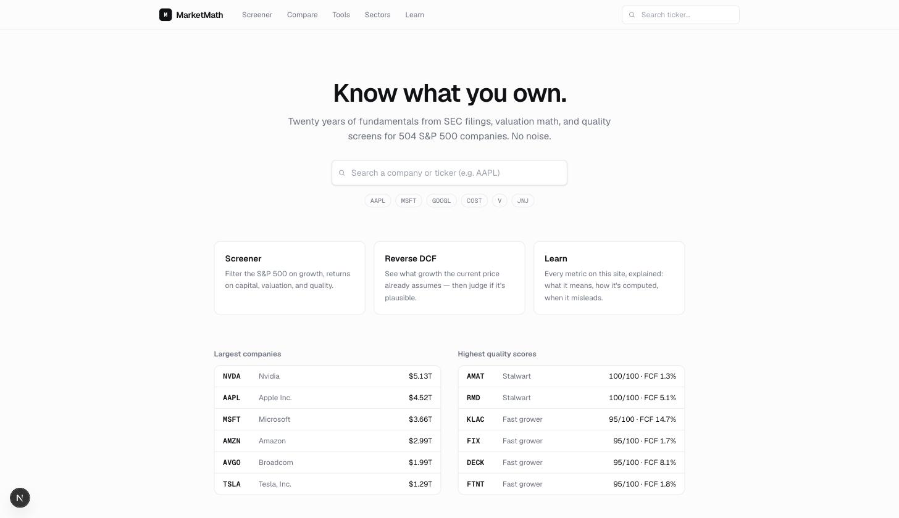
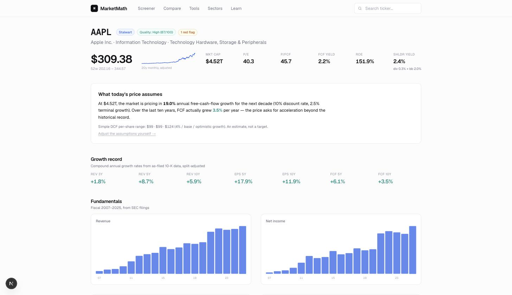
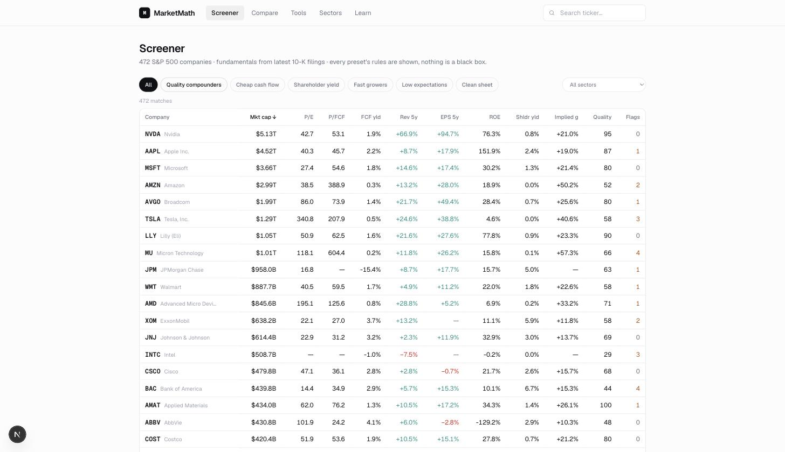
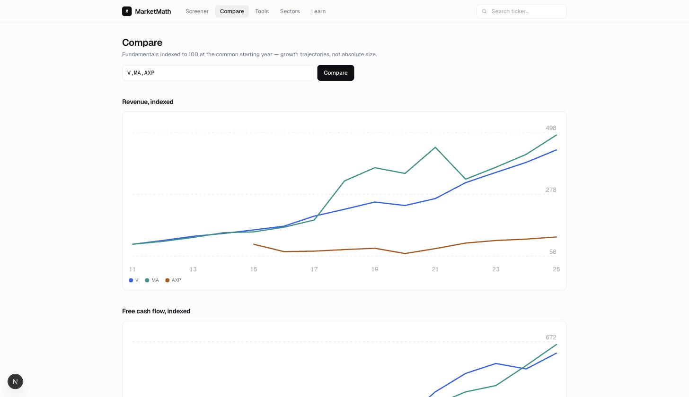
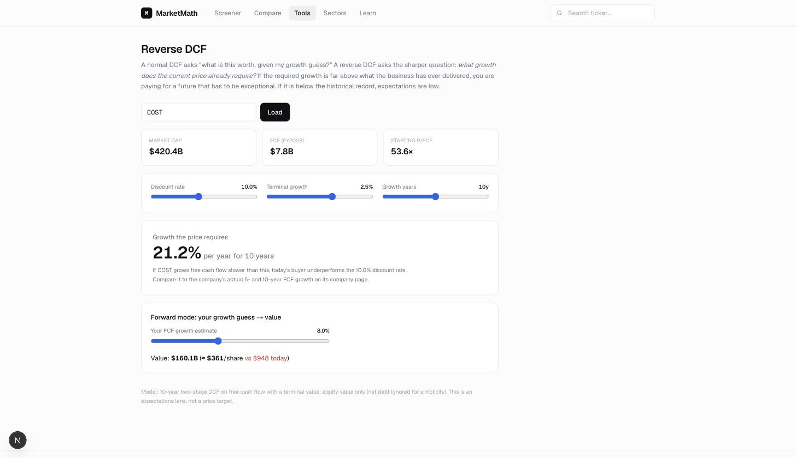
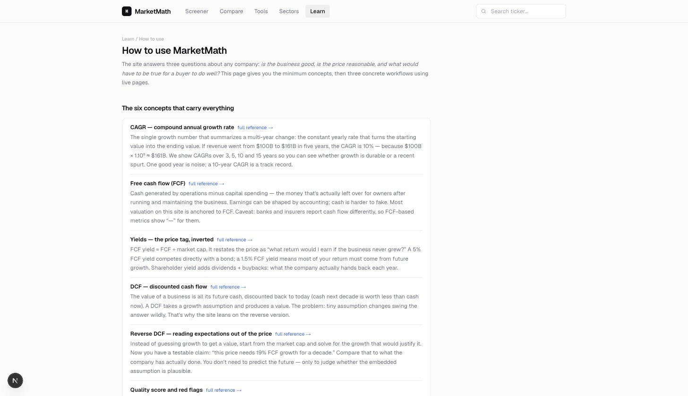

# MarketMath

Fundamentals dashboard for the S&P 500. Twenty years of as-filed 10-K data per company, valuation math, transparent quality scores, and small interactive calculators. Live at **https://marketmath-theta.vercel.app**.

Every number is traceable to an SEC filing; every score and preset prints its rules. In-app docs: [/about](https://marketmath-theta.vercel.app/about) (data pipeline, design choices, alternatives) and [/learn/how-to-use](https://marketmath-theta.vercel.app/learn/how-to-use) (concepts + workflows).



## Using the app

### 1. Judge one company — `/company/[ticker]`

Search any S&P 500 ticker. The page is ordered as an argument, top to bottom:

- **Header badges** — Lynch-style classification (slow grower / stalwart / fast grower), quality score 0–100, red-flag count.
- **"What today's price assumes"** — a reverse DCF in one sentence: the FCF growth rate the market cap requires, next to what the company actually delivered. This gap is the core question of the whole app.
- **Growth record + charts** — CAGRs over 3/5/10y; 20 years of revenue, net income, FCF, share count (falling = buybacks), margins, capital returned, cash vs debt.
- **Track record** — CAGR table across every series; $100-vs-SPY over 3/5/10/15 years; Buffett's $1 test (market value created per $1 of retained earnings).
- **Quality & capital discipline** — cash ROIC, debt in years of FCF, SBC/FCF, sales efficiency (new PP&E per $1 of new revenue), and the growth-engine decomposition (reinvestment rate × incremental ROIC).
- **Red flags** — mechanical threshold checks; each one is a question to take to the 10-K (linked at the bottom).
- **Financial data table** — the full resolved history, split-adjusted.



### 2. Find ideas — `/screener`

Pick a preset (its rules are printed — nothing hidden), sort a column to sharpen, shortlist, then run step 1 on each candidate. Presets: Quality compounders, Cheap cash flow, Shareholder yield, Fast growers, Low expectations (implied growth ≤4% via reverse DCF), Clean sheet (zero flags).



### 3. Choose between rivals — `/compare`

Up to 6 tickers, indexed to 100 at the common start year: revenue, FCF, and share-count trajectories, plus the sales-efficiency table showing who buys growth cheaply.



### 4. Test price assumptions — `/tools/reverse-dcf`

Sliders for discount rate, terminal growth, horizon → implied growth updates live. Forward mode turns your own growth guess into a per-share value. Also: `/tools/compounding`, `/tools/enough-number`.



### 5. Learn — `/learn`

40 metric docs (formula, why it matters, thresholds, caveats) + 6 guides (reading a 10-K, quality, valuation, expectations investing, red flags, capital allocation) + the how-to-use walkthrough.



## Architecture

```
SEC EDGAR (XBRL companyfacts) ─┐
Yahoo v8 chart (prices, SPY)   ├─► ingest/resolve/adjust/derive ─► Supabase (mm_* tables) ─► Next.js (reads DB only)
Wikipedia S&P 500 (universe)  ─┘        (seed script + Vercel crons)
```

- **Resolve**: per (company, concept, fiscal-year) tag-fallback chains over raw XBRL facts; 10-K forms only, 330–380-day periods, canonical-frame/latest-filed dedup (`src/lib/ingest/sec.ts`).
- **Adjust**: split adjustment inferred from >1.8× share-count discontinuities (`src/lib/metrics.ts`).
- **Derive**: ~40 metrics per company stored in `mm_metrics` (CAGRs, margins, cash returns, yields, reverse-DCF implied growth, quality score, red flags).
- **Refresh**: `vercel.json` crons — prices weekday evenings (2 parts), fundamentals weekly rotation by `cik % 7`. Routes under `src/app/api/cron/*` (Bearer `CRON_SECRET`).
- Pages never fetch external APIs at request time.

## Development

```bash
npm install
# .env.local needs: NEXT_PUBLIC_SUPABASE_URL, NEXT_PUBLIC_SUPABASE_ANON_KEY,
# SUPABASE_SERVICE_ROLE_KEY, SEC_EDGAR_USER_AGENT ("name email"), CRON_SECRET
npm run dev

# Full data seed (~25 min for 503 tickers + SPY; rate-limit friendly)
npx tsx scripts/seed.ts
# Partial: --tickers AAPL,MSFT --limit 50 --skip-fundamentals --skip-prices
```

Tables (Postgres/Supabase, `mm_` prefix): `mm_companies`, `mm_fundamentals_annual`, `mm_prices_monthly`, `mm_metrics`. RLS: public read, service-role write.

## Limitations

S&P 500 only; annual data (no quarters until the next 10-K); banks/insurers structurally lack FCF-based metrics (shown as “—”); split adjustment approximate; prices delayed. Educational project — not investment advice.
